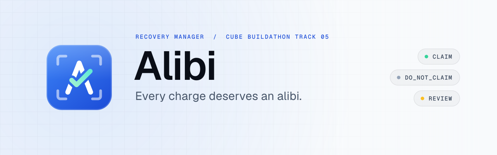
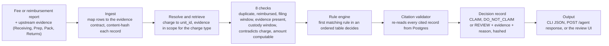
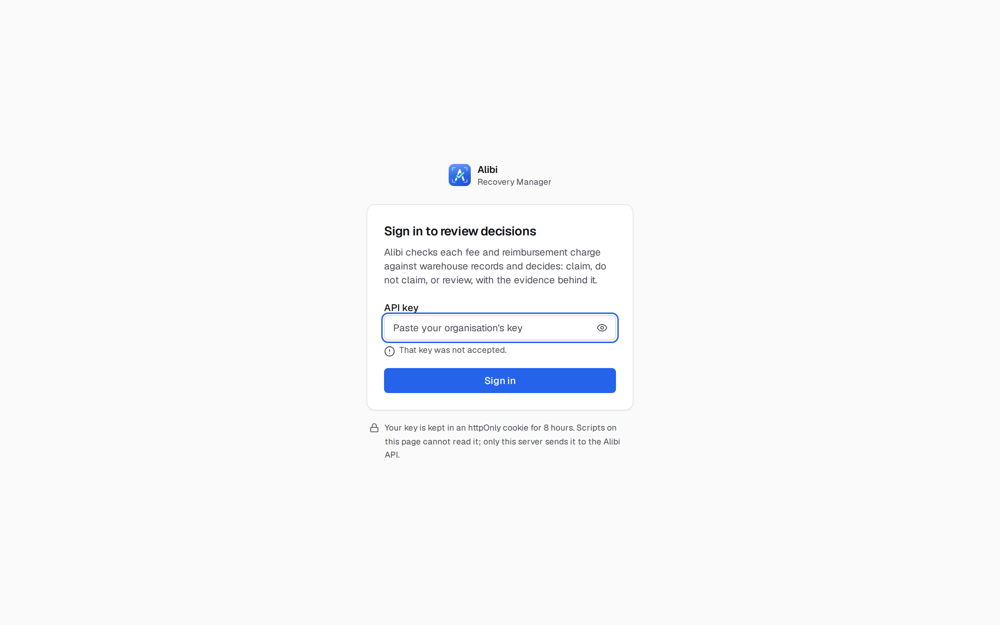
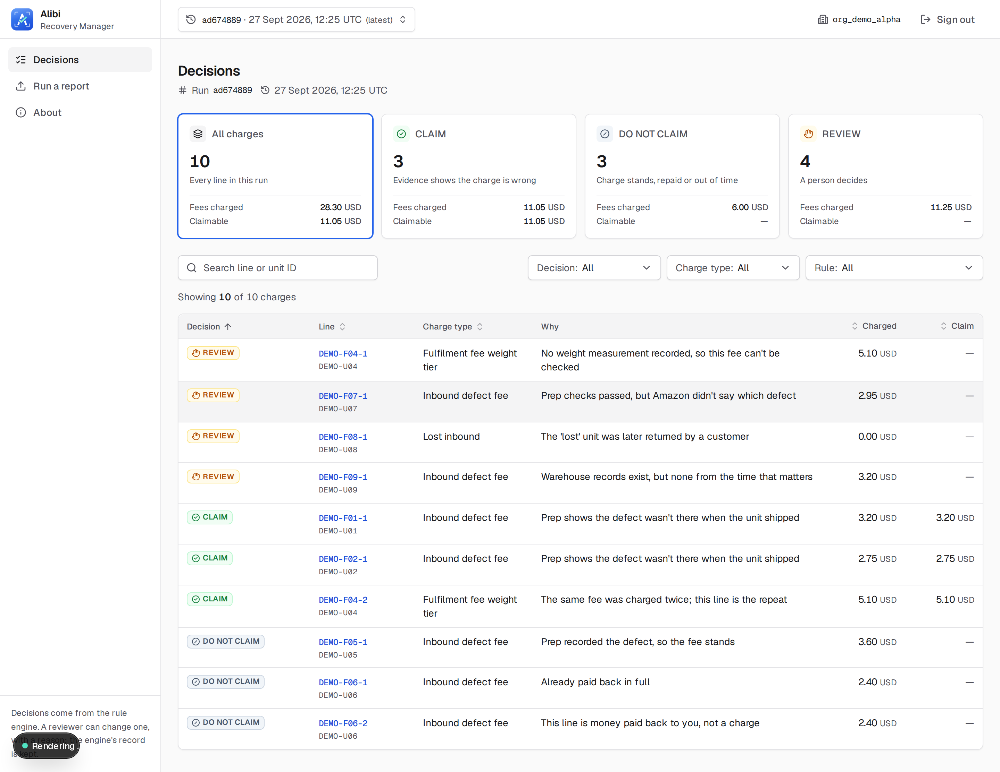
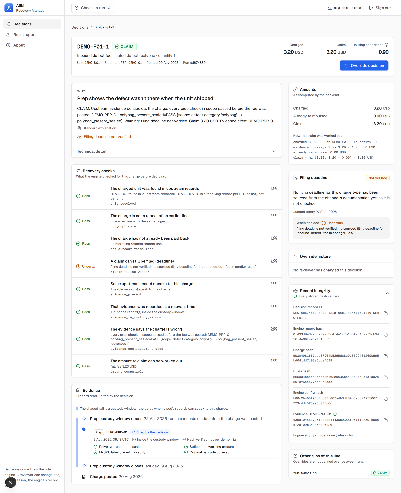
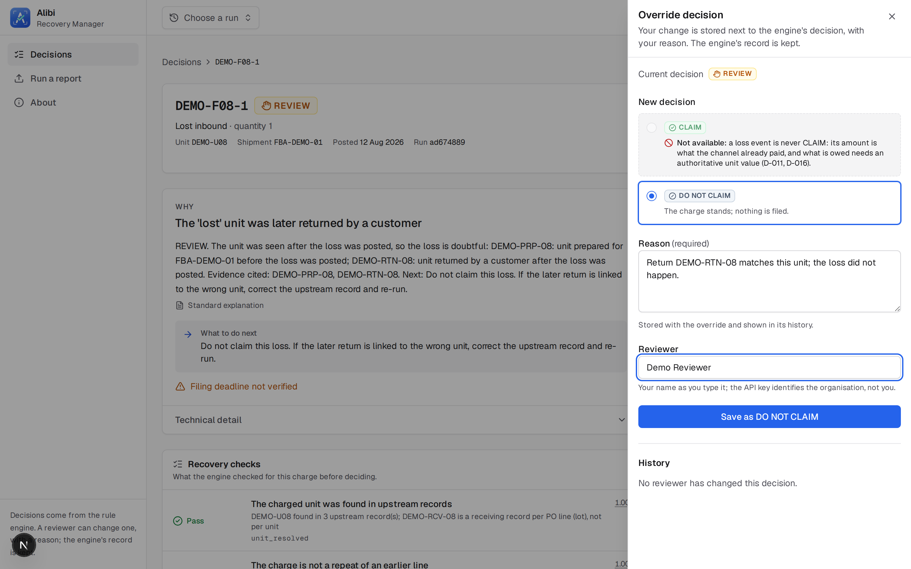

<p align="center"><picture>
  <source media="(prefers-color-scheme: dark)" srcset="docs/brand/alibi-banner-dark.svg">
  
</picture></p>

Decides whether a marketplace fee or reimbursement charge should be claimed, and shows the evidence it used.

Sellers are charged fees and short reimbursements they usually cannot contest, because contesting needs evidence they do not have to hand. Alibi ingests a fee or reimbursement report, matches each charge to the unit evidence recorded upstream by Receiving, Prep, Pack and Returns, and returns one of three decisions — CLAIM, DO_NOT_CLAIM or REVIEW — with the evidence and the reason attached. Every check a decision rests on, the evidence record it read, and the rule that fired are stored with a content hash and re-verified on every read, so a claim is never asserted without evidence and missing or ambiguous evidence routes to REVIEW rather than a guess.

## Quick links

| | |
|---|---|
| Live UI | <https://alibi-recovery.vercel.app> |
| Live API health | <https://alibi-api-cvkvkc3ssq-ts.a.run.app/health> |
| Demo video | not recorded yet — see the screenshots in [Usage](#usage) and [`docs/screenshots/`](docs/screenshots/) |
| Evaluation report | [`eval/README.md`](eval/README.md) (method and the held-out set; the report itself is pending, see [Evaluation](#evaluation)) |
| Architecture | [`ARCHITECTURE.md`](ARCHITECTURE.md) |
| Deploy evidence | [`docs/deploy/`](docs/deploy/), [`eval/llm-smoke-2026-09-27.txt`](eval/llm-smoke-2026-09-27.txt) |

## Contents

- [Problem](#problem)
- [Solution](#solution)
- [Workflow](#workflow)
- [Live deployment](#live-deployment)
- [Local setup](#local-setup)
- [Usage](#usage)
- [Assumptions](#assumptions)
- [Limitations](#limitations)
- [Evaluation](#evaluation)
- [Repository layout](#repository-layout)
- [Further reading](#further-reading)

## Problem

Amazon (and other channels) charge inbound defect fees, lose units, damage inventory in the warehouse, and sometimes fail to return an item a customer sent back. Some of these charges are wrong, or have already been reversed by a reimbursement, or would be claimable if a seller could point to the record that proves it. Today a seller either pays an agency a percentage to chase these by hand, does it themselves at the cost of hours per charge, or does not bother. Recovery Manager is the fifth of five agents in the buildathon's chain (Receiving, Prep, Pack, Returns, Recovery); the first four each produce evidence about a unit's condition and handling, and Recovery is the one that turns that evidence into a claim decision. It has no camera and no capture surface: its only inputs are the charge report and the upstream evidence records.

## Solution

Alibi is a rule engine, not a model. A fee or reimbursement report and the four upstream evidence files are ingested into a fixed evidence contract shape. For each charge, the engine resolves the unit, retrieves the evidence in scope for that charge type, runs eight deterministic checks against it (duplicate, already reimbursed, filing window, evidence present, evidence in the custody window, evidence contradicts or supports the charge, amount computable), and the first matching rule in an ordered table decides CLAIM, DO_NOT_CLAIM or REVIEW. A citation validator re-reads every cited evidence record and charge from Postgres before the decision is stored, so a decision can never point at evidence that was not actually read. An optional step (`LLM_ENABLED=true`) asks Gemini on Vertex AI to write a plain-English explanation of a decision already made; the model's text is validated against the decision's own trace (every ID, date and number in it must appear in the trace, and it may not argue for a different decision) and discarded for a template if it fails. The model never sets a decision, an amount or a citation. Details: [`ARCHITECTURE.md`](ARCHITECTURE.md).

A small Next.js review UI lets a human see every decision of a run, the evidence timeline behind one decision, and override a decision with a mandatory reason; overrides are stored append-only, never overwriting the engine's own record.

## Workflow



If a charge's decision step raises, that charge is still stored as REVIEW with status `pending` rather than dropped (fail open, [`ARCHITECTURE.md`](ARCHITECTURE.md#decision-path-one-organisation-one-run)).

## Live deployment

| Component | Where | Region |
|---|---|---|
| API (FastAPI, Cloud Run) | <https://alibi-api-cvkvkc3ssq-ts.a.run.app> | `australia-southeast1` |
| Database (Postgres, Supabase) | private, behind the API | `ap-southeast-2` |
| Review UI (Next.js, Vercel) | <https://alibi-recovery.vercel.app> | `syd1` |
| Model explanations (Gemini on Vertex AI) | `gemini-2.5-flash`, via the Cloud Run service identity | `us-central1` |

`LLM_ENABLED=true` in production: every decision carries a model-written explanation, validated against its own decision trace, or falls back to the template with a recorded reason.

**Signing in.** The review UI needs an organisation API key. Judges receive one through the submission form; keys are never committed to this repository. Open the live UI, paste the key, and sign in. Each key belongs to one organisation and only ever shows that organisation's runs.

Deploy evidence, captured 2026-09-27: [`docs/deploy/smoke-live-2026-09-27.txt`](docs/deploy/smoke-live-2026-09-27.txt) (23 of 23 checks against the live API and UI: authentication, tenancy isolation, the review UI end to end), [`docs/deploy/check-db-2026-09-27.txt`](docs/deploy/check-db-2026-09-27.txt) (row-level security forced on every table, the app role limited to `SELECT, INSERT`, no Data API role has access, connection over SSL), [`eval/llm-smoke-2026-09-27.txt`](eval/llm-smoke-2026-09-27.txt) (one real, validated Vertex AI call). Full deploy steps: [`DEPLOY.md`](DEPLOY.md).

## Local setup

A stranger with a clean machine needs: Postgres 16, [`uv`](https://docs.astral.sh/uv/), Node LTS, and Docker if using the bundled Postgres.

```bash
git clone <your fork's URL> alibi && cd alibi
cp .env.example .env                # fill in ATTACHMENT_KEY_SECRET at least (any random string)
make install                        # backend dependencies
make db-up                          # Postgres 16 via docker compose (or point *_DATABASE_URL at your own)
make review-ui                      # migrate, decide the sample report for both demo orgs, API on :8000, UI on :3000
```

Open <http://localhost:3000> and sign in with one of the keys the command prints (`dev-only-alpha-review-key` for `org_demo_alpha`, `dev-only-bravo-review-key` for `org_demo_bravo`; local use only). `make lint test` runs the backend and eval test suites against a real Postgres database (row-level security is tested against Postgres, not SQLite). Details, including the optional model-explanation setup, are in [`frontend/README.md`](frontend/README.md) and [`ARCHITECTURE.md`](ARCHITECTURE.md#model-usage-d-022).

## Usage

### Review UI

| Sign in | Decisions |
|---|---|
|  |  |
| **Decision detail** | **Override** |
|  |  |

Dark-mode and phone-width captures are in [`docs/screenshots/`](docs/screenshots/). REVIEW decisions are listed first; every decision links to the evidence records it cites, each with a content hash; a decision can be overridden with a mandatory reason, and the override history is kept, never overwritten.

### CLI

```bash
cd backend
uv run alibi run --report ../data/fee_report_sample.csv --upstream ../data/upstream/ --org org_demo_alpha
```

### API

All endpoints require `X-API-Key`; the key is bound to one organisation, which the caller cannot override. Replace `$KEY` with an organisation key.

```bash
# Health check (no key needed)
curl -s https://alibi-api-cvkvkc3ssq-ts.a.run.app/health

# Who am I
curl -s -H "X-API-Key: $KEY" https://alibi-api-cvkvkc3ssq-ts.a.run.app/me

# Submit a report and its upstream evidence, get decisions back
curl -s -H "X-API-Key: $KEY" \
  -F "report=@fee_report.csv" \
  -F "upstream=@receiving_2026-09.csv" \
  -F "upstream=@prep_2026-09.csv" \
  -F "upstream=@pack_2026-09.csv" \
  -F "upstream=@returns_2026-09.csv" \
  https://alibi-api-cvkvkc3ssq-ts.a.run.app/agent

# List decisions of the newest run, filtered to REVIEW
curl -s -H "X-API-Key: $KEY" \
  "https://alibi-api-cvkvkc3ssq-ts.a.run.app/decisions?decision=REVIEW"

# One decision, with its evidence trail and override history
curl -s -H "X-API-Key: $KEY" \
  https://alibi-api-cvkvkc3ssq-ts.a.run.app/decisions/<record_id>

# Override a decision (mandatory reason)
curl -s -X POST -H "X-API-Key: $KEY" -H "Content-Type: application/json" \
  -d '{"new_decision": "DO_NOT_CLAIM", "reason": "confirmed with Seller Central", "reviewer": "a.reviewer"}' \
  https://alibi-api-cvkvkc3ssq-ts.a.run.app/decisions/<record_id>/overrides
```

Full endpoint reference: [`ARCHITECTURE.md`](ARCHITECTURE.md#api).

## Assumptions

- **No official evidence schema exists.** The organisers confirmed no exact JSON schema for `subject`, `agent`, `images` or `outcome` was published (D-008). Alibi builds from the handbook's field list and documents every shape choice in [`docs/DECISIONS.md`](docs/DECISIONS.md) D-008.
- **The sample CSVs are synthetic.** Amounts, fee schedules and requirement flags in `data/` are invented for the buildathon and never used as a source of channel rules.
- **`client_id` is set to `organization_id`** for csv_v0 rows, since the sample CSVs carry no separate client column (D-008).
- **A charge's posted date stands in for the event date** a sourced filing window counts from, where no upstream record carries the true event date (D-017).
- **Duplicate charges are themselves claimable**: the earlier, canonical charge is the evidence a duplicate is wrong (D-003).

## Limitations

- **No official evidence schema exists** for the upstream contract (D-008); Alibi's adapter is a best-effort mapping from the handbook's field list, not a validated schema.
- **Filing windows are sourced from a single forum post** (a 2024 Seller Central announcement, retrieved by a human, verbatim excerpt in [`config/rules/amazon_us.yaml`](config/rules/amazon_us.yaml)), which that post itself says may be superseded. Two of five charge types (`lost_inbound`, `fulfilment_fee_weight_tier`) have no sourced window at all: `within_filing_window` is UNCERTAIN and the reason says so, never a guess.
- **Single region.** API, database and UI run in one region each (`australia-southeast1`, `ap-southeast-2`, `syd1`); there is no failover region.
- **Cold start.** The API scales to zero between requests; the first request after idle takes a few seconds while an instance starts.
- **32 MiB upload limit** on `POST /agent` (Cloud Run's own request body limit); a larger report or upstream file must be split.
- **The Supabase project is on the free tier** and pauses after a period of inactivity; the first request after a pause can take longer while it resumes.
- **Reviewer identity is self-declared.** The API key identifies an organisation, not a person; an override's `reviewer` field is whatever the caller sends.
- **Overrides do not carry across re-runs.** A new run decides fresh; an earlier override of the same charge line is shown as history, not reapplied.
- **`(D-0NN)` citations inside a rule's `reason` or `next_action` text are read by the explanation validator as unrecognised IDs**, so a model explanation that quotes one verbatim falls back to the template (fails safe; tracked in [`docs/BACKLOG.md`](docs/BACKLOG.md)).

## Evaluation

Method: two humans label a held-out set of charges independently, before the agent ever runs on them ([`eval/README.md`](eval/README.md), [`eval/LABELLING_GUIDE.md`](eval/LABELLING_GUIDE.md)). `eval/run_eval.py` (`make eval`) refuses to run unless both label files are committed to git, unchanged, and cover every case of the labelling sheet exactly; it reports raw agreement and Cohen's kappa between the two labellers before any resolution, then runs the real pipeline and reports claim precision, false and missed claims, REVIEW rate, per-charge-type breakdown, latency, cost and named failure modes to `eval/REPORT.md`. It exits non-zero if the agent makes even one false claim (the hard gate) or if any charge is left without a decision. A single-labeller mode exists for a partial pass (gold is the one labeller's set directly, agreement is not computed, and the report says so); it is never entered silently when a second labeller's file is partially done, only when it is empty.

**Pending: human labels not yet committed (see eval/README.md).**

## Repository layout

```
backend/app/{core,models,db,ingest,adapters,precheck,resolution,retrieval,engine,claims,llm,review,api}
backend/tests/          backend test suite (pytest, real Postgres)
eval/                   held-out eval set, human labels, eval harness, reports
demo/                   small made-up demo report (never used for accuracy claims)
frontend/               review UI (Next.js)
config/rules/           authoritative channel rules, with source URL and retrieval date
config/engine.yaml      this project's own engineering choices (not channel rules)
deploy/                 Cloud Run and Supabase deploy scripts
docs/                   ROUND2_PLAN.md, PROGRESS.md, DECISIONS.md, BACKLOG.md, deploy evidence, screenshots
```

## Further reading

- [`ARCHITECTURE.md`](ARCHITECTURE.md): components, data flow, security, reliability, the decision table.
- [`docs/DECISIONS.md`](docs/DECISIONS.md): every design decision, dated and reasoned.
- [`docs/PROGRESS.md`](docs/PROGRESS.md): session-by-session build log.
- [`DEPLOY.md`](DEPLOY.md): how the live deployment was built, step by step.
- [`eval/README.md`](eval/README.md): the held-out set and how it was chosen.
